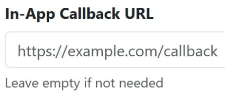

# IAP Server Validation

This mechanism provides secure server-to-server confirmation of in-game purchases to prevent transaction spoofing and ensure data integrity.

Upon a successful payment, our server sends a Webhook Request (POST) to your endpoint. You must verify the cryptographic signature before delivering items to the player.

## 1. Configuration
#### To authorize your server to receive webhook requests:
1. [Open the Admin Console](/upload-game/admin-panel/)
2. Click on the game title to open its settings
3. Find the In-App Callback URL field

4. Enter your server's destination URL (e.g., https://api.yourgame.com/payments/webhook)
5. Save Changes

## 2. Webhook specification
#### The notification is delivered as an HTTP POST request. Transaction details are passed via query parameters.

| **Parameter** | **Description** |
| :--- | :---: |
| `item_id` | Unique ID of the purchased item |
| `item_name` | Name of the purchased item |
| `user_id` | Unique identifier of the user |
| `tx_id` | Unique transaction identifier |

## 3. Reference Implementation (Go)
```go
func validateSignature(data url.Values, publicKey ed25519.PublicKey) bool {
  signatureBase64 := data.Get("signature")
  data.Del("signature")
   
  pairs := make([]string, 0, len(data))
  for k, v := range data {
    if len(v) > 0 {
      pairs = append(pairs, fmt.Sprintf("%s=%s", k, v[0]))
    }
  }
   
  sort.Strings(pairs)
  dataString := strings.Join(pairs, "\n")
   
  signature, err := base64.RawURLEncoding.DecodeString(signatureBase64)
  if err != nil {
    return false
  }
   
  return ed25519.Verify(publicKey, []byte(dataString), signature)
}
```

`publicKey = BqaLruQ7mr8W1fLQudycM3AiVb6LOvyBOEm6Wy3sKS8=`

*The request parameters will look similar to this:*
```item_id=235&item_name=Common+lootbox&signature=gNw...-Dg&tg_id=122374628'```
