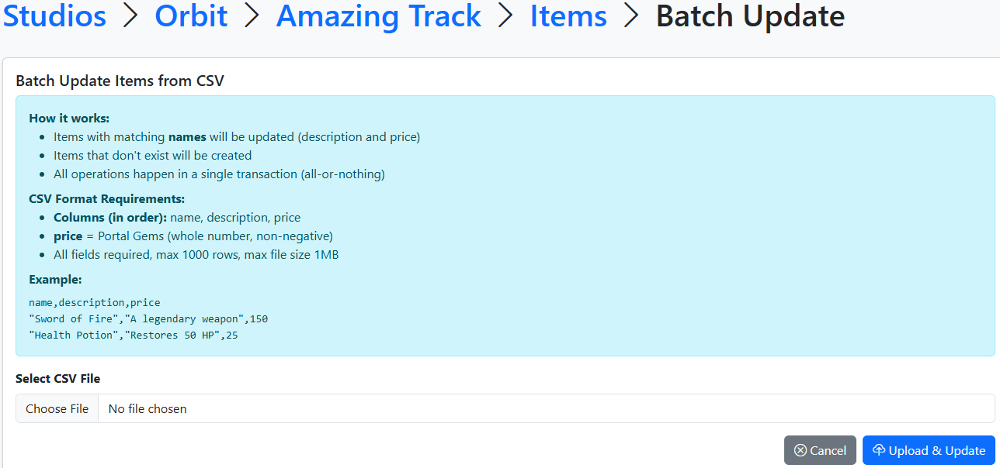
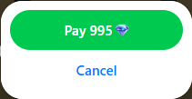
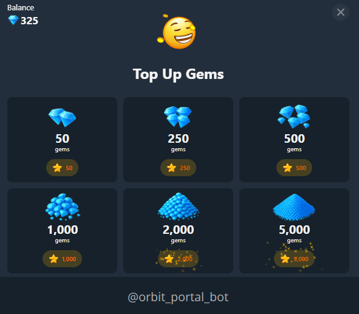

# In-game purchases
This section explains how to manage your game's store inventory, including adding new products and performing bulk updates.

## How to add, edit, or remove items
**[1. Access the Admin Console](../upload-game/admin-panel.md)**

**2.  In the game list, find your game and click the light-blue `Items` icon (cube) in the **Actions** column.**


**3. You now have access to the dashboard where you can view and modify item IDs, names, descriptions, and prices.**
  

### Control Elements

To populate or modify your shop, use the control buttons in the top-right corner:

*   **Create new item**: Opens a form to manually add a single product. You will need to define:
    *   **ID**: A unique identifier (must match the ID used in your game code).
    *   **Name & Description**: Internal metadata for your convenience. **Note:** This information is only visible in the Admin Console and is not displayed to players.
    *   **Price**: The cost of the item.
*   **Batch Update**: For bulk operations with game items, use the **Batch Update** feature:
    - The system uses **CSV files** for bulk operations.

    - You will find detailed **CSV format** requirements and a data example directly on the **Batch Update** page


## How to use Shop API

After you create your items, you can integrate them into your game.   

#### 1. First of all, you need to get all your items:
=== "Unity"
	```C#
	var items = await PortalSDK.GetShopItems();
	```
=== "JavaScript"
	```js
 	const response = await PortalSDK.getShopItems();
	```
=== "Defold"
	```lua
    portalsdk.get_shop_items(function(self, data) end)
	```

`ShopItem` has the same fields as in the admin, and the most important is the `id`

=== "Unity"
    ```C#
    public class ShopItem
    {
        /// <summary>
        /// The unique identifier of the shop item.
        /// </summary>
        public int id;

        /// <summary>
        /// The name of the shop item.
        /// </summary>
        public string name;

        /// <summary>
        /// The description of the shop item.
        /// </summary>
        public string description;

        /// <summary>
        /// The price of the shop item.
        /// </summary>
        public int price;

        /// <summary>
        /// The date and time when the shop item was created.
        /// </summary>
        public DateTime created;

        /// <summary>
        /// The date and time when the shop item was last updated.
        /// </summary>
        public DateTime updated;
    }
    ```
=== "JavaScript"
    ```JS
    interface ShopItem {
        id: number;
        name: string;
        description: string;
        price: number;
        created: string;
        updated: string;
    }
    ```
=== "Defold"
	```lua
	local shopItem = {
	    id = 1,
	    name = "Sample Item",
	    description = "This is a sample shop item.",
	    price = 100,
	    created = "2025-06-12T10:00:00Z",
	    updated = "2025-06-12T12:00:00Z"
	}
	```

#### 2. The second important API method is `getPurchasedShopItems`:

=== "Unity"
    ```C#
    var purchased = await PortalSDK.GetPurchasedShopItems();
    ```  
=== "JavaScript"
    ```JS
    const purchased = await PortalSDK.getPurchasedShopItems();
    ```
=== "Defold"
	```LUA
    portalsdk.get_purchased_shop_items(function(self, result)
        -- purchased shopItems
    end)
	```
It gives you all the purchased items by the current player.   
Now you can display your shop screen and associate your items with `ShopItems` from the API and mark purchased it.

If your item can be purchased infinitely, you can just not mark it.
<ins>SDK API does not limit you in the number of purchased items per player.</ins>   

#### 3\. Make a code to buy an item by `id`
=== "Unity"
	```C#
	var result = await PortalSDK.OpenPurchaseConfirmModal(itemId);
	if (result is { IsSuccessful: true }) {
        Debug.Log("Purchase successful!")
    }
    else {
        Debug.Log("Purchase failed.")
    }
	```
=== "JavaScript"
	```JS
    const shopItems = await PortalSDK.getShopItems();

    const shopItem = shopItems.find(item => item.id === itemId)

	const result = await PortalSDK.openPurchaseConfirmModal(shopItem);

    if(result.status === "success") {
        console.log("Purchase successful!")
    } else {
        console.log("Purchase failed.")
    }
	```
=== "Defold"
	```lua
    portalsdk.open_purchase_confirm_modal(itemId, function(self, result)
        if result.status == "success" then
            print("Purchase successful!")
        else
            print("Purchase failed.")
        end
    end)
	```
After player will see modal window:  
    
  If a user doesn't have enough balance, a top-up popup will be shown  
    
  If the player confirms a purchase, after all, you will get the response `IsSuccessful = true` or `status == "success"`
## Resources
Here’s a gem icon you can use in your in-game store.  
We’ve packed it in an archive with different sizes and formats, so it’s easy to add.  
We recommend using it to make your shop look clear and familiar to players.  
Here icon examples:  
  
&#8194;x1&#8195;&#8195; x2&#8195;&#8195;&#8195; x3

You can dowload icons here:
[Icons.zip](../static/icons.zip)
---
## Next Steps
After setting up your items, proceed to [IAP Server Validation](/integration/iap-validation/) to secure your transactions.