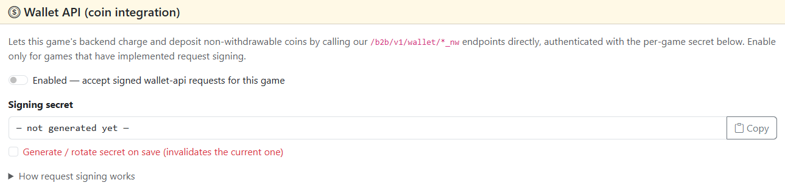

# Wallet API integration 

#### Integrating the Wallet API to manage Portal Games coins (charging, depositing, and checking balances).
!!! info "Wallet API Scope"
    The **Wallet API** described in this guide is designed specifically for managing non-withdrawable **Portal Coins** (`*_nw` endpoints).

## 1. Obtain the signing secret in the Admin Console
1. [Open the Admin Console](/upload-game/admin-panel/)
2. Click on the game title to open its settings
3. Find the **Wallet API (coin integration)** field

4. Check the **Generate / rotate secret on save (invalidates the current one)** checkbox and click **Save Changes**
5. Copy the generated hex key from the **Signing Secret** field
6. Toggle the **Enabled — accept signed wallet-api requests for this game** switch to ON and click **Save Changes**

## 2. Configure game backend
!!! warning
    All Wallet API requests must originate strictly from your server, never from the client side (Unity, JS/HTML5 builds, mobile app). The Signing Secret must never be exposed to clients

#### Request body schema (Payload)
Every request to the Wallet API endpoints must include game_id and user_id in the JSON body, along with any endpoint-specific parameters (e.g., amount).
``` JSON
{
  "game_id": 328,
  "user_id": 269203607
}
```
!!! attention
    Always pass the correct **game_id** for your application in every payload to identify the calling game properly.

#### To authenticate requests, your server must sign each HTTP request using HMAC-SHA256:
1. Capture the current Unix timestamp in seconds (`X-Timestamp`).
2. Compute the SHA-256 hex hash of the raw JSON request body *(Note: If the body is empty, hash an empty string `""`)*.
3. Join the components with newlines (`\n`):
!!! note "Important"
    Ensure your implementation uses strictly `\n` (LF) and NOT `\r\n` (CRLF), even on Windows environments.
```
HTTP_METHOD
ENDPOINT_PATH
UNIX_TIMESTAMP
BODY_SHA256_HEX
```
#### Example Signing String & Payload  
For a JSON request payload of {"game_id": 328, "user_id": 269203607}:
``` 
POST
/b2b/v1/wallet/charge_nw
1700000000
5a089b4b0e8c67a508b5df8e42fcf5bc92fb387060ba9be8b2e35183ef9f6dc2
``` 
4. Generate a hex-encoded HMAC-SHA256 signature using your Signing Secret as the key.

## 3. Send first request
#### Dispatch an HTTP POST request to the target endpoint with the required headers:
- **Base URL:** https://app.portalapp.games
#### Required HTTP headers
``` 
Content-Type: application/json
X-Timestamp: 1700000000
X-Signature: <calculated_hmac_sha256_hex_signature>
```
#### Example Request Body
``` JSON
{
  "game_id": 328,
  "user_id": 269203607
}
```
#### Available endpoints
| Method | Endpoint | Description |
| :--- | :--- | :--- |
| POST | /b2b/v1/wallet/charge_nw | Debits coins (User - Game) |
| POST | /b2b/v1/wallet/deposit_nw | Credits coins (Game - User) |
| POST | /b2b/v1/wallet/deposit_nw_batch | Credits coins to multiple users at once |
| POST | /b2b/v1/wallet/balance_nw | Fetches Portal Games coin balance |

## 4. Integration verification checklist
#### Before deploying to production, run through this verification checklist:
- 200 OK Success: Server accepts the signature and processes the payload correctly
- Clock Sync: Server clock is synchronized via NTP  
Secret Safety: The Signing Secret is stored in .env or standard key-vault (not in source code)

#### Troubleshooting common errors
!!! failure "401 Unauthorized"
    - Game Disabled: Check if the Enabled toggle is switched ON in the Admin Console.
    - Clock Drift: Timestamps differing by more than 5 minutes from server time are rejected.
    - Path Mismatch: Ensure the path in the signing string includes the leading slash (e.g., /b2b/v1/wallet/charge_nw) and excludes the Base URL (https://app.portalapp.games).
    - Incorrect Hash: Verify the raw JSON string matches the payload being sent over HTTP character-for-character (including whitespace).

!!! failure "400 Bad request"
    - Invalid or missing fields in the JSON request body schema.