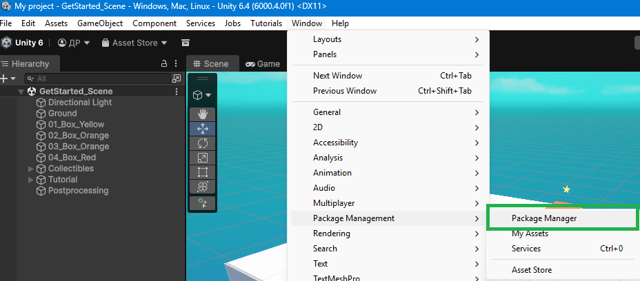
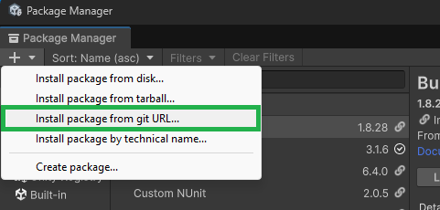
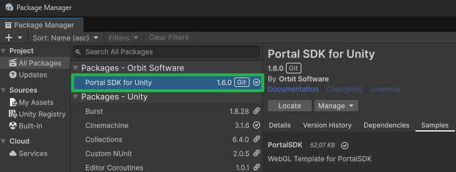
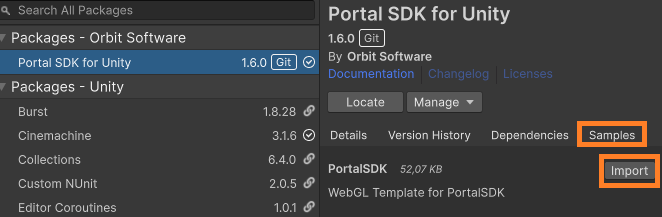
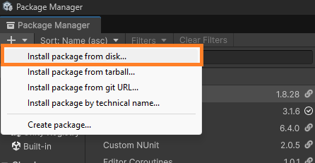
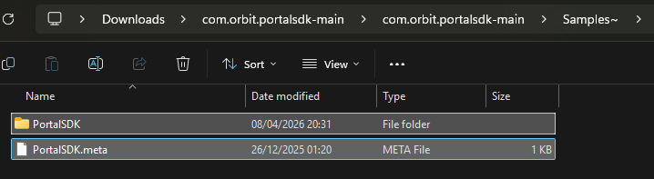
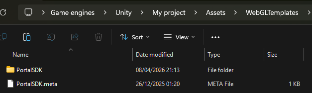
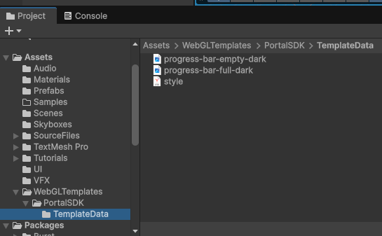
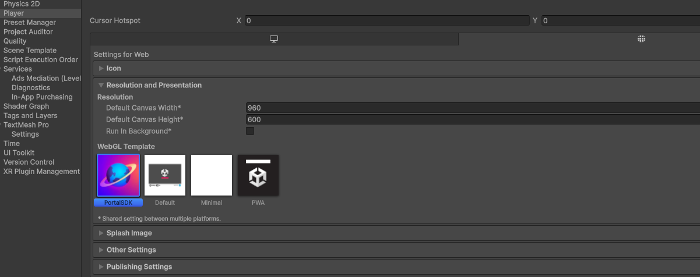
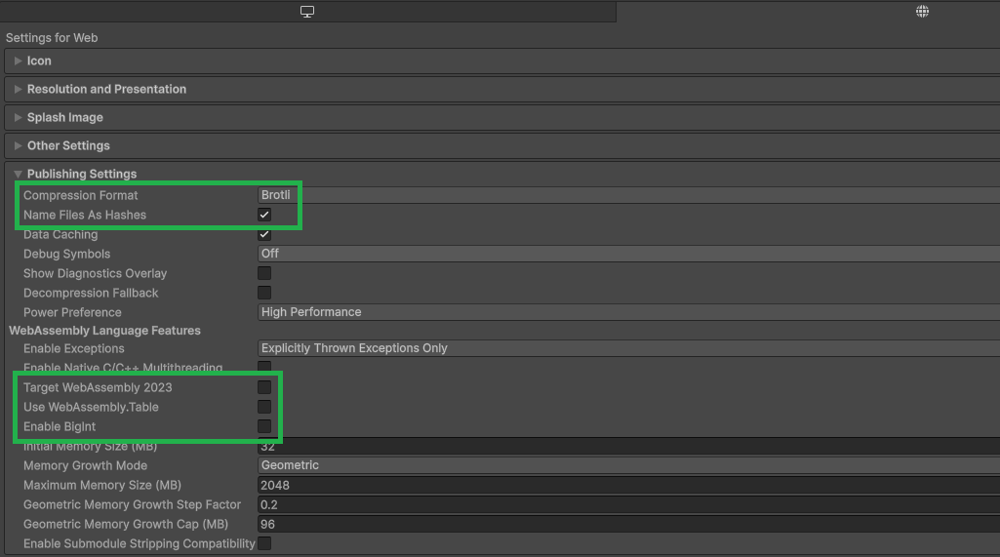

# Unity Engine

### **Prerequisites**  
  To work with PortalSDK, you’ll need the following:

**Unity Versions:** Unity 2022 LTS, or Unity 6 LTS (Unity 6 is preferable due to updated WebGL support).  
**Installed WebGL Platform:** Ensure that the WebGL Platform module is installed in your Unity setup.

### Unity WebGL Limitations
Unity’s WebGL platform offers a powerful way to run games on the web, but there are some limitations to keep in mind:

- **Performance Constraints:** WebGL applications run within a browser and have different performance limits than desktop builds.
- **Memory Management:** WebGL has specific memory constraints and handles memory differently, which can affect large games.
- **Networking:** WebGL networking relies on the browser’s capabilities and may not support all network configurations.
- **Texture Compression:** Only certain types of texture compression are supported, which can impact visual quality and loading times.

For more detailed information, check the links below.
### Links to Unity Documentation on WebGL Performance and Limitations
For in-depth information about optimizing and working within Unity’s WebGL platform, refer to these resources:

- [WebGL Performance](https://docs.unity3d.com/Manual/webgl-performance.html)
- [WebGL Texture Compression](https://docs.unity3d.com/Manual/webgl-texture-compression.html)
- [WebGL Embedded Resources](https://docs.unity3d.com/Manual/webgl-embeddedresources.html)
- [WebGL Networking](https://docs.unity3d.com/Manual/webgl-networking.html)
- [WebGL Memory Management](https://docs.unity3d.com/Manual/webgl-memory.html)
- [WebGL Audio](https://docs.unity3d.com/Manual/webgl-audio.html)
---
## How to set up Unity Game with PortalSDK
### Workflow 1: Remote installation (via UPM)

#### 1.1. Install SDK via git URL
1. In the Unity Editor, go to **Window > Package Manager**

2. Click the **"+"** button and select **Add package from git URL...**

3. Enter the following URL and click **Install**:  
   `https://github.com/orbit-software/com.orbit.portalsdk.git`

#### 1.2 Import the WebGL template
1. In the **Package Manager**, select the **PortalSDK** package

2. In the **Samples** section, click **Import** next to **PortalSDK WebGL Template**

### Workflow 2: Local installation (manual)

#### 2.1. Add package from disk
1. Download and extract the [PortalSDK repository](https://github.com/orbit-software/com.orbit.portalsdk) repository to a folder on your computer (preferably outside your Unity project)

2. In Unity, open the **Package Manager**

3. Click the **"+"** button and select **Add package from disk...**

4. Navigate to the extracted folder and select the `package.json` file

#### 2.2. Manual template setup
1. In your file explorer, go to the **extracted com.orbit.portalsdk folder** (from step 2.1) and navigate to `Samples~`
2. Copy the entire PortalSDK folder along with its PortalSDK.meta file and paste them into your Unity project at Assets/WebGLTemplates/

    *Note: Manually create the WebGLTemplates folder if it does not exist.*

### Final Configuration

#### 1. Set the WebGL Template
1. Go to `Edit > Project Settings > Player in Unity`
2. Under the **WebGL settings**, find the **WebGL Template** selector
3. Select *PortalSDK* from the selector to apply it as your template

#### 2. Mandatory Publishing Settings

| Property | Required Value |
| :--- | :--- |
| **Compression Format** | `Brotli` |
| **Name Files As Hashes** | `True` |
| **Target WebAssembly 2023** | `False` |
| **Use WebAssembly.Table** | `False` |
| **Enable BigInt** | `False` |

### Build and Test

To test your game, you have two options:

#### Option A: Local Testing (Recommended for Development)

Build and Run in Unity will only work with the PortalSDK if you configure local testing parameters.

For instructions on how to test your Unity WebGL game locally with full PortalSDK functionality (overlay, ads, IAPs), see the [Local Testing Guide](/setup/local-testing/).

#### Option B: Upload to Platform

Alternatively, you can upload your build to the platform for testing:

1. In Unity, go to **File > Build Settings**
2. Select **WebGL** as your platform and click **Switch Platform**
3. Click **Build** (not Build and Run)
4. Upload the build files to GitHub following the [Upload Game Guide](/upload-game/0-upload-game/)

!!! note
    Without local testing configuration, "Build and Run" will launch the game but the PortalSDK features (overlay, ads, IAPs) will not function properly. You must either use local testing OR upload to the platform.