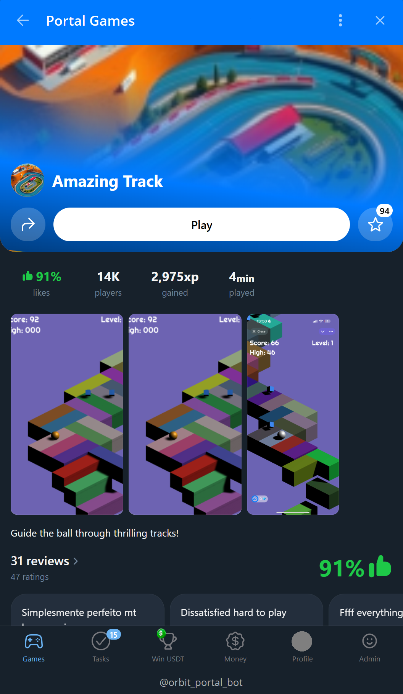

# Upload game

_Note: Access to the upload games is provided by request and requires your GitHub email._

To upload games, we use `GitHub` as the primary platform for managing and storing build files.
Simply push your game's build files into the designated `/public/` directory. 

## How to upload game to platform
#### 1. You will have access to the GitHub repository for the game:

#### 2. Push your build files into `/public/` directory

#### 3. After a few minutes your game can be accessed in the Portal. 
{width="400px"}