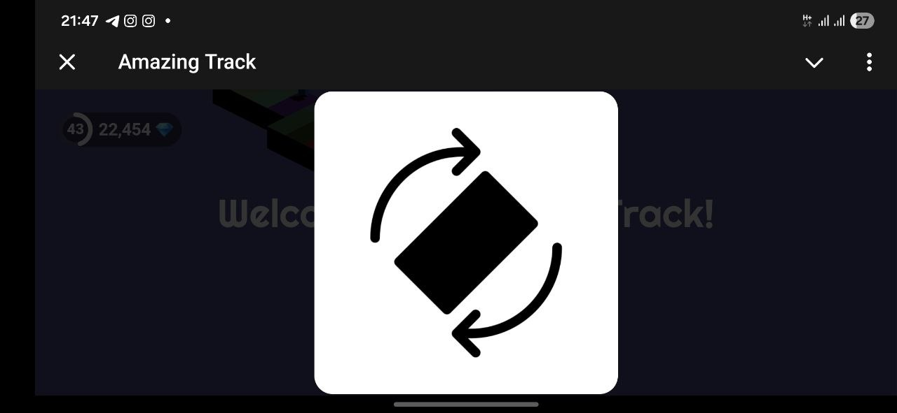

# Admin Console

_Note: Access to the console is provided by request and requires your Telegram nickname._

## How to get access

#### 1. Send command `/admin` to the Telegram bot  [@orbit_portal_bot](https://t.me/orbit_portal_bot/)

#### 2. You will get a link to the admin console where you can administrate your games

## How to add, edit, or remove items

!!! info ""
    Detailed guide on managing your game's store inventory: [In-game purchases](/integration/iap)
  
## Display and visibility configuration
#### 1. Screen orientation and fullscreen mode
    
 
!!! success "Fullscreen mode is handled automatically by the SDK"
_Example: Automatic system prompt for screen rotation._
 

#### 2. Game visibility
This setting controls the game's visibility and publication status within Portal Games
 
!!! info "Private staging"
- New games are set to **Hidden** by default and are invisible to regular users.
- **Visibility Toggle:** Click the **"eye"** icon in the **Actions** column to switch between *Hidden* and *Public* states.

## Game presentation configuration  
#### 1. Basic Information: game name, description, genres...

 

#### 2. Appearance

 

#### 3. Media: screenshots, image, avatars, ...

 