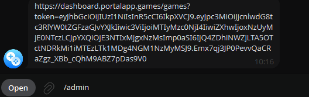
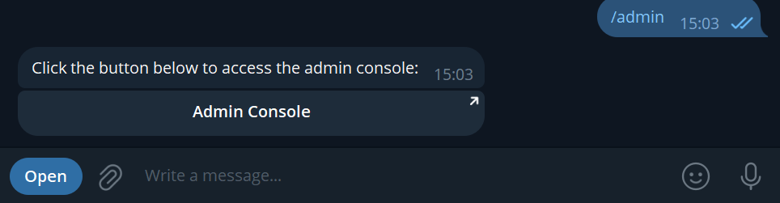
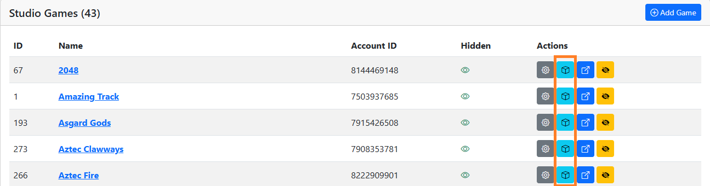
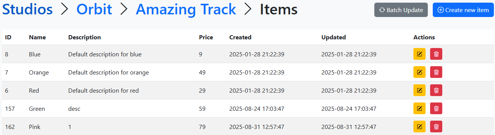
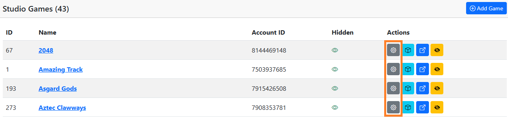
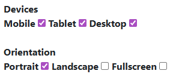
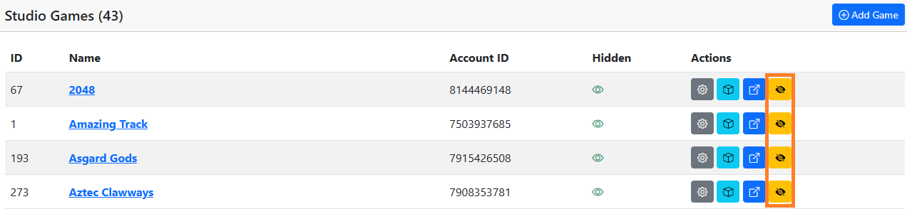
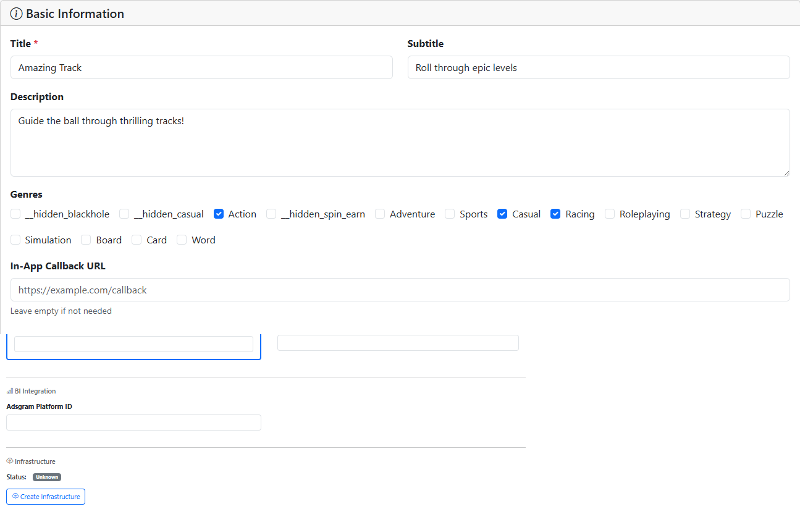
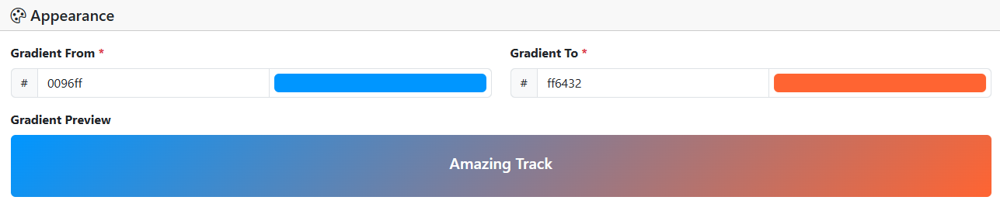
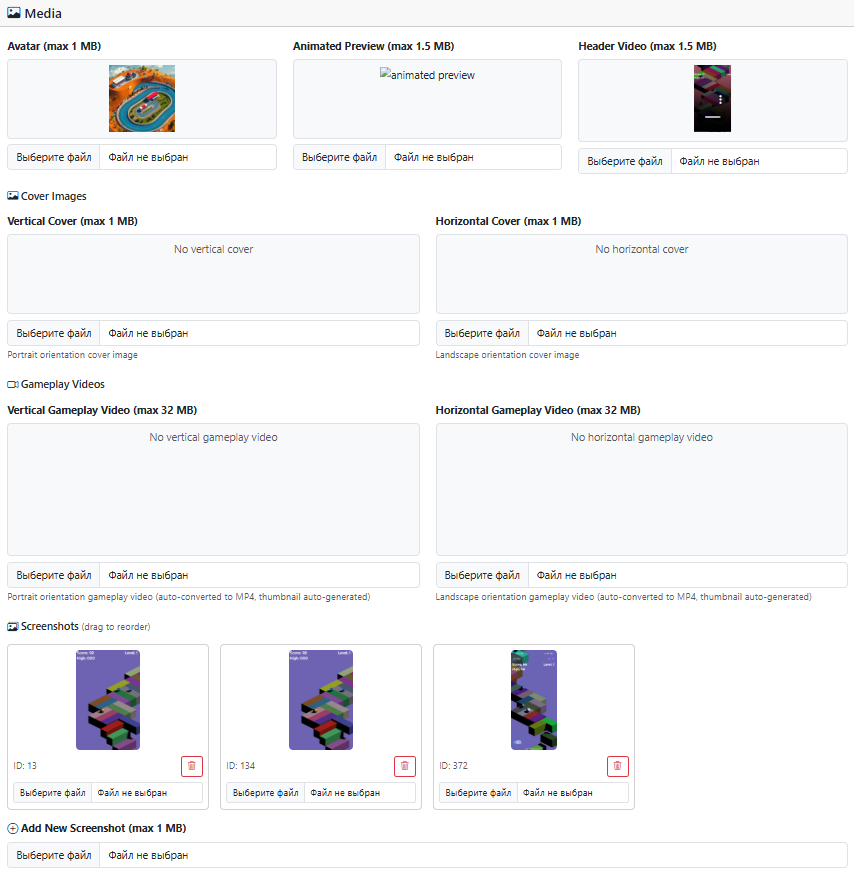

# Admin Console

_Note: Access to the console is provided by request and requires your Telegram nickname._

### How to get access ###

#### 1. Send command `/admin` to the Telegram bot  [@orbit_portal_bot](https://t.me/orbit_portal_bot/)

#### 2. You will get a link to the admin console where you can administrate your games

### How to add, edit, or remove items

#### 1. Select one of your games and click the store button `Items`

#### 2. You have access to change items, their description, and prices

  
### Display and visibility settings
#### 1. Change supported devices, screen orientation, and fullscreen mode settings

 
 

#### 2. Game visibility and availability
 

### Game presentation configuration  
#### 1. Basic Information: game name, description, genres...

 

#### 2. Appearance

 

#### 3. Media: screenshots, image, avatars, ...

 